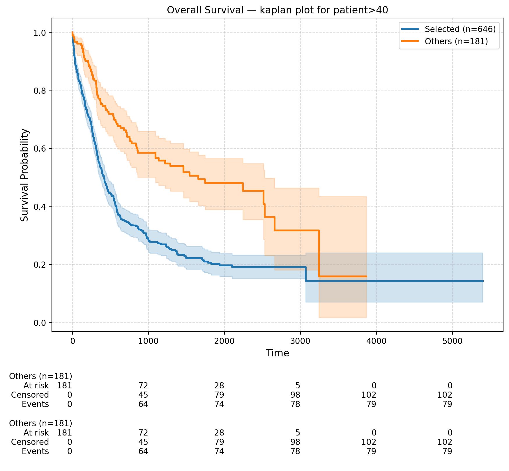

# nlq-cohort-builder
**LLM-powered cohort builder** - Translate natural language queries into validated criteria JSON and executable SQL for cohort selection, enabling researchers to define cohorts without needing to write database queries manually.

## Features

* **Natural Language to Criteria JSON** – Parse user queries into structured inclusion/exclusion criteria.
* **Multi-Stage Refinement Pipeline**:
  1. Raw criteria extraction
  2. Entity recognition
  3. Schema-based table/field mapping
  4. Concept/value mapping
  5. Criteria rewriting with resolved concepts → final cohort query
* **Structured Validation with Pydantic** – Enforces consistent schema for each stage, reducing errors from LLM output.
* **User Feedback Loop** – Supports iterative edits/refinements to criteria.
* **SQL Generation** – Produces optimized cohort queries from refined criteria.


## Installation and usage
```
# Install uv
uv venv cohort_builder
source ./cohort_builder/bin/activate
uv pip install -r requirements.txt
```
or

```
# Create conda/pip venv
conda create -n cohort_builder
conda activate cohort_builder
pip install -r requirements.txt
```
### Usage
```
streamlit run scripts/app_streamlit.py
```
or 

```
# In a anotebook
from scripts import agent_viz
agent_viz.app
agent_viz.ask('kaplan-meier plot for patient>40')
```


